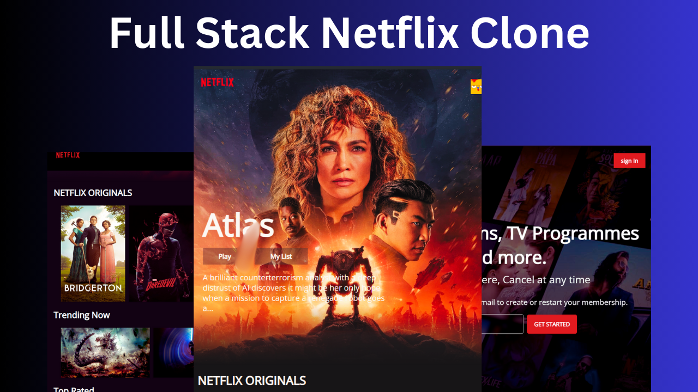

# 🍿 Netflix Clone Project 🎬

This project is a feature-rich web application replicating the core functionalities of Netflix. Built using React for the frontend, styled with Tailwind CSS, and powered by Firebase for backend services, this clone integrates the IMDb API to fetch and display detailed movie and TV show information.



## ✨ Features

### 👤 User Authentication
- **Sign Up & Login:** 🔐 Secure user authentication using Firebase Authentication
- **Profile Management:** 👪 Create and switch between multiple user profiles
- **User Preferences:** 💾 Save favorites and continue watching progress
- **Login System:** 🔒 Ensures only authentic users can access personalized content

### 🎥 Movie/Show Browsing
- **Home Page:** 🏠 Dynamic display of trending, popular, and recommended content
- **Genre Categories:** 🔍 Browse content by genres with smooth horizontal scrolling
- **Dedicated Sections:** 📺 Separate categorized sections for Movies, TV Series, New Releases, and more
- **Content Organization:** 📋 Clear categorization of content types (Movies, Series, etc.)

### 🔎 Search Functionality
- **Global Search:** 🔍 Find specific movies or shows across the entire catalog
- **Advanced Filters:** ⚙️ Filter by genre, release year, rating, and more
- **Search History:** 📜 View recent searches for quick access
- **Real-time Results:** ⚡ Instant search results as you type

### 📱 Responsive Design
- **Multi-Platform:** 💻 Fully responsive layout for desktop, tablet, and mobile devices
- **Adaptive UI:** 📱 Interface elements that adapt to different screen sizes
- **Consistent Experience:** 🎨 Uniform styling and functionality across all devices

### 🎬 Movie/Show Details
- **Comprehensive Info:** ℹ️ Detailed pages with synopsis, cast, ratings, and reviews
- **Trailers & Previews:** 🎞️ Watch trailers directly within the application
- **Related Content:** 🔄 Suggestions for similar movies and shows

## 🛠️ Technology Stack

- **Frontend:** ⚛️ React.js with functional components and hooks
- **Styling:** 🎨 Tailwind CSS for utility-first styling
- **State Management:** 📊 Redux for global state management
- **Backend & Database:** 🔥 Firebase (Authentication, Firestore, Storage)
- **API Integration:** 🎞️ IMDb API for comprehensive movie and show data
- **Deployment:** 🚀 Firebase Hosting for production deployment

## 🚀 Getting Started

### Prerequisites
- Node.js (v14.0 or higher) 📦
- Firebase account 🔥
- IMDb API key 🎬

### Installation

1. Clone the repository:
```bash
git clone https://github.com/Prathamesh06203/netflix-clone
cd netflix-clone
```

2. Install dependencies:
```bash
npm install
```

3. Create a `.env` file in the root directory and add your Firebase and IMDb API credentials:
```env
REACT_APP_API_KEY=your_imdb_api_key
REACT_APP_FIREBASE_API_KEY=your_firebase_api_key
REACT_APP_FIREBASE_AUTH_DOMAIN=your_firebase_auth_domain
REACT_APP_FIREBASE_PROJECT_ID=your_firebase_project_id
REACT_APP_FIREBASE_STORAGE_BUCKET=your_firebase_storage_bucket
REACT_APP_FIREBASE_MESSAGING=your_firebase_messaging_sender_id
REACT_APP_FIREBASE_APP_ID=your_firebase_app_id
```

4. Start the development server:
```bash
npm run dev
```

5. Open your browser and navigate to `http://localhost:3000`

## 🔥 Key Implementation Details

### User Authentication Flow
- Email/password registration and login
- Google/Facebook OAuth integration
- Secure session management
- Password reset functionality

### Data Fetching & Management
- Efficient API data caching
- Lazy loading of content for improved performance
- Real-time updates for user-specific data

### UI/UX Features
- Netflix-style animations and transitions
- Skeleton loaders during content fetching
- Infinite scrolling for content lists

## 🎯 Task Completion Status

This project fully satisfies the requirements for **Task 5: Netflix Clone** by implementing:

✅ Movie Listings: Categorized sections for Movies, Series, etc.  
✅ Search Functionality: Find specific movies/shows quickly and efficiently  
✅ User Authentication: Secure login system to ensure authentic users  
✅ Movie API Integration: Dynamic content via IMDb API  

The implementation exceeds expectations by also including:
- Multiple user profiles
- Responsive design for all devices
- Detailed movie information pages
- Saved preferences and watch history

## 📝 Future Enhancements

- **Content Rating System:** 🌟 Allow users to rate and review content
- **Offline Viewing:** 📥 Download functionality for offline access
- **Personalization:** 🧠 AI-driven content recommendations
- **Social Features:** 👥 Share and recommend content to friends

## 📜 License

This project is licensed under the MIT License - see the LICENSE file for details.

## 🙏 Acknowledgements

- Netflix for design inspiration
- IMDb for providing the comprehensive movie database
- The React and Firebase communities for excellent documentation and support
